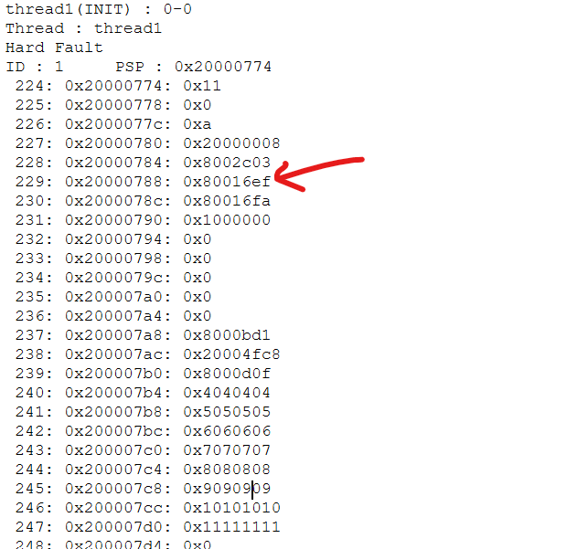
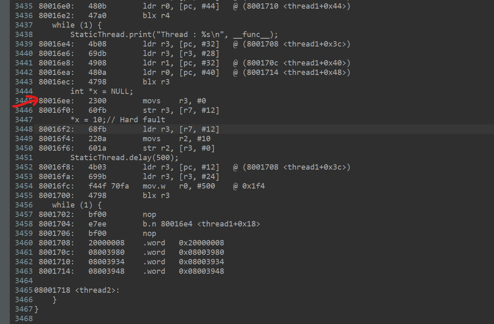

# Code

```c
/*
 * stm32_thread_OS_test.c
 *
 *  Created on: Oct 21, 2023
 *      Author: Niruja
 */

#include
"stm32_thread_OS.h"
#include
"main.h"
#include
"stdio.h"
#include
"string.h"

extern UART_HandleTypeDef huart1;

int _write(int file, char *data, int len) {
	HAL_UART_Transmit(&huart1, (uint8_t*) data, len, HAL_MAX_DELAY);
	return len;
}

///////////////////////////HANDLER///////////////////////
void HardFault_Handler(void) {
	printf("Hard Fault\n");
	StaticThread.printStack(0, 1);
	while (1) {
	}
}

void SVC_Handler(void) {
	StaticThread.SVCHandler();
}

void PendSV_Handler(void) {
	StaticThread.PendSVHandler();
}

void SysTick_Handler(void) {
	HAL_IncTick();
	StaticThread.SysTickHandler();
}

///////////////////////////THREAD/////////////////////////
#define STACK_SIZE 256

int id1, id2;
uint32_t thread1Stack[STACK_SIZE];
uint32_t thread2Stack[STACK_SIZE];

static void thread1(int argLen, void **args) {
	StaticThread.print("%s(INIT) : %d-%p\n", __func__, argLen, args);
	while (1) {
		StaticThread.print("Thread : %s\n", __func__);
		int *x = NULL;
		*x = 10; // Hard fault
		StaticThread.delay(500);
	}
}

static void thread2(int argLen, void **args) {
	StaticThread.print("%s(INIT) : %d-%p\n", __func__, argLen, args);
	while (1) {
		StaticThread.print("Thread : %s\n", __func__);
		StaticThread.delay(500);
	}
}

void run() {
	printf("Initiating...\n");
	HAL_Delay(1000);

	id1 = StaticThread.new(thread1, thread1Stack, sizeof(thread1Stack) / sizeof(uint32_t), 0, NULL);
	id2 = StaticThread.new(thread2, thread2Stack, sizeof(thread2Stack) / sizeof(uint32_t), 0, NULL);
	StaticThread.startScheduler();
}
```
# Outputs

```text
thread1(INIT) : 0-0
Thread : thread1
Hard Fault
ID : 1	PSP : 0x20000774
 224: 0x20000774: 0x11
 225: 0x20000778: 0x0
 226: 0x2000077c: 0xa
 227: 0x20000780: 0x20000008
 228: 0x20000784: 0x8002c03
 229: 0x20000788: 0x80016ef
 230: 0x2000078c: 0x80016fa
 231: 0x20000790: 0x1000000
 232: 0x20000794: 0x0
 233: 0x20000798: 0x0
 234: 0x2000079c: 0x0
 235: 0x200007a0: 0x0
 236: 0x200007a4: 0x0
 237: 0x200007a8: 0x8000bd1
 238: 0x200007ac: 0x20004fc8
 239: 0x200007b0: 0x8000d0f
 240: 0x200007b4: 0x4040404
 241: 0x200007b8: 0x5050505
 242: 0x200007bc: 0x6060606
 243: 0x200007c0: 0x7070707
 244: 0x200007c4: 0x8080808
 245: 0x200007c8: 0x9090909
 246: 0x200007cc: 0x10101010
 247: 0x200007d0: 0x11111111
 248: 0x200007d4: 0x0
 249: 0x200007d8: 0x0
 250: 0x200007dc: 0x2020202
 251: 0x200007e0: 0x3030303
 252: 0x200007e4: 0x12121212
 253: 0x200007e8: 0xfffffffd
 254: 0x200007ec: 0x80016cd
 255: 0x200007f0: 0x1000000
```

# Program counter

Addressing resembling 0x800xxxx is program counter. By subtracting 1 we can identify the line in .list file.


# .list file



